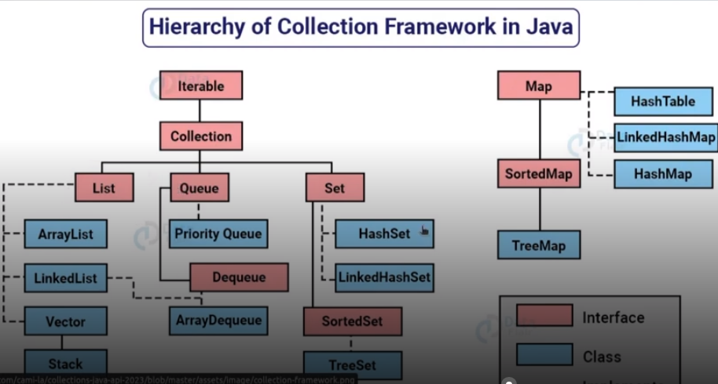

# collection-java-api-dio-2023

Uma collection é uma estrutura de dados que servem para agrupar muitos elementos em uma única unidade que precisarão ser objetos

Uma collection pode ter coleções homogêneas ou heterogêneas bem parecido com array, mas com suas peculiaridades.
Colocamos muitos objetos dentro de uma variável.
Dentro de collection não existe tipos primitivos e somente classes ex. 

Não utiliza-se tipos primitivos

double x
e sim
Double x

Temos quatro grandes tipos de coleções: List(lista), Set(conjunto), Queue(fila) e Map(papa), a partir dessas interfaces temos muitas subclasses concretas que implementam várias formas diferentes de trabalhar com collections.



Este pacote de Collection está dentro do java.util

# Generics Type

```
    public class Box{
        private Object object;
    
    public void set(Object object){
            this.object = object;
        }
        public void get(){
            return object;
        }
    }

    public clas Box<T>{
        private T t;

    public void set(T t){
        this.t =t;
    }
    public T get(){
        return t;

    
    }
}
```
# Nomes de parâmetros mais utilizados

E - Elemento (usado extensivamente pelo Java Collections FrameWork)
K - Chave
N - Número
T - Tipo
V - Valor
S, U, V etc... - 2º, 3º, 4º Tipos

# Vantagens em utilizar Collection em Java

- Segurança do tipo de dados ( garante utilização de objeto de tipo específico)
- Código mais legivel        (especificamos o tipo de dado esperado ou retornado)
- Detecta erros mais cedo    (o compilador verifica se estamos utlizando tipos corretos)
- Reutilização de códigos    (Permite criar classes genéricas)
- Melhor desempenho          (evita necessidade de conversões de tipos desnecessários cast)  

# Interfaces Comparable e Comparator

São interfaces que servem para ordenar coleção com base em um único elemento, como id, nome ou preço etc...

# Comparable 

compareTo()

-> única sequência de ordenação  package java.lang

-> afeta a classe principal


Class minhaClasse implements Comparable<MinhaClasse>
somos então obrigado a implementar os métodos compareTo(parametros..)

ou ordenar os elementos da lista utilizando o método Collections.sort(List)

# Comparator 

comare()

--> fornece múltiplas sequências de ordenação. id, nome, preco etc...

--> Não afeta a classe principal somos obrigados a criar uma outra classe para implementar para então poder utiliza-lo

Podemos ordenar os elementos da lista comparator usando o método Collection.sort(List, comparator)

# Collections

--> fornece operações comuns sort() reverse()

# List Interface

# Operções básicas com o List

Ver arquivos no pacote list.
A Interface List implemeta a Interfaces Iterable e Collections


O List pode conter elementos duplicados.

# Utilizando Set em Java

A Interface Set implementa a Interfaces Iterable e Collections

O Set não permite conter elementos duplicados.

Represena conjuntos 
Ex 

Baralho de cartas, porém de diferentes cartas....

A plataforma Java possui três implementações de Set

HashSet serão inseridos em forma aleatória.


